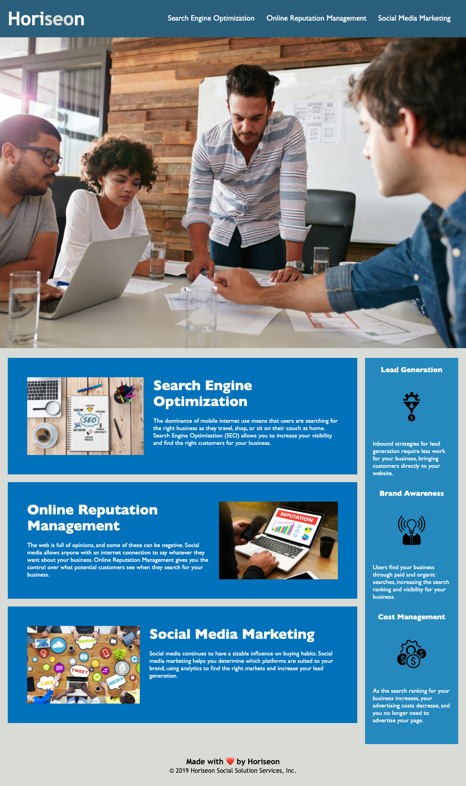

# Refactor-Homework

## Description

This is the Horiseon website. The client wanted a codebase that follows accessibility standards to optimize its search engine results. I added semantic HTML elements, consolidated classes, added alt attributes to the images, and re-structured the stylesheet. I included comments to organize the sections of the webpage.

```md

```

# Deployed Site

Here's the site:
[Deployed Site]("https://jdinh3.github.io/Refactor-Homework/")
